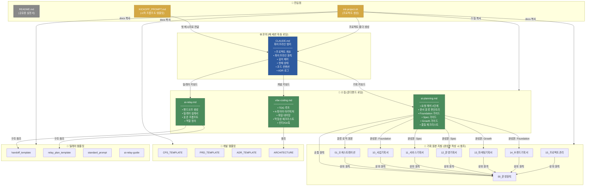
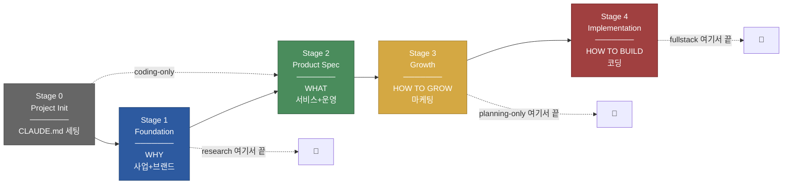
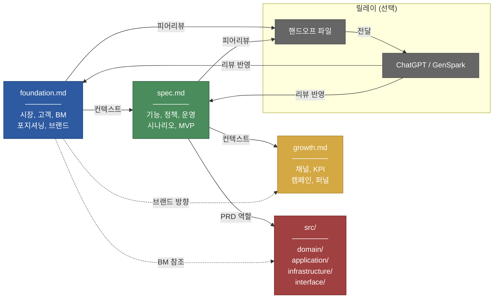
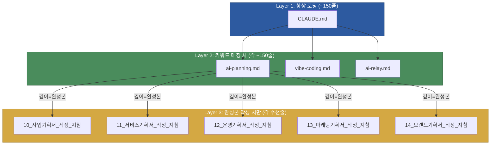

# 방법론 파일 연결 다이어그램

## 전체 구조

```mermaid
flowchart TB
    subgraph ENTRY["🚀 진입점"]
        README["README.md<br/>(공유용 설명서)"]
        KICKOFF["KICKOFF_PROMPT.md<br/>(시작 프롬프트 템플릿)"]
        INIT["init-project.sh<br/>(프로젝트 생성)"]
    end

    subgraph CORE["⚙️ 코어 (매 세션 자동 로딩)"]
        CLAUDE["CLAUDE.md<br/>파이프라인 앵커<br/>───────────<br/>• 프로젝트 개요<br/>• 파이프라인 원칙<br/>• 깊이 제어<br/>• 현재 상태<br/>• 코드 컨벤션<br/>• ADR 로그"]
    end

    subgraph SKILLS["🔧 스킬 (온디맨드 로딩)"]
        PLAN["ai-planning.md<br/>───────────<br/>• 요청 해석 4단계<br/>• 문서 분류 판단트리<br/>• Foundation 가이드<br/>• Spec 가이드<br/>• Growth 가이드<br/>• 품질 체크리스트"]
        VIBE["vibe-coding.md<br/>───────────<br/>• TDG 루프<br/>• 4-레이어 아키텍처<br/>• 파일 네이밍<br/>• 멱등성 체크리스트<br/>• 린터/Git훅"]
        RELAY["ai-relay.md<br/>───────────<br/>• 핸드오프 생성<br/>• 릴레이 설계서<br/>• 표준 프롬프트<br/>• 역할 정의"]
    end

    subgraph DOCS_PLAN["📄 기획 원본 지침 (완성본 작성 시 참조)"]
        D00["00_운영원칙"]
        D01["01_오케스트레이션"]
        D10["10_사업기획서"]
        D11["11_서비스기획서"]
        D12["12_운영기획서"]
        D13["13_마케팅기획서"]
        D14["14_브랜드기획서"]
        D15["15_프로젝트관리"]
    end

    subgraph DOCS_VIBE["📄 개발 템플릿"]
        CPS["CPS_TEMPLATE"]
        PRD["PRD_TEMPLATE"]
        ADR["ADR_TEMPLATE"]
        ARCH["ARCHITECTURE"]
    end

    subgraph DOCS_RELAY["📄 릴레이 템플릿"]
        HO["handoff_template"]
        RP["relay_plan_template"]
        SP["standard_prompt"]
        RG["ai-relay-guide"]
    end

    %% 진입점 → 코어
    KICKOFF -->|"첫 메시지로 전달"| CLAUDE
    INIT -->|"프로젝트 폴더 생성"| CLAUDE
    INIT -->|"스킬 복사"| SKILLS
    INIT -->|"docs 복사"| DOCS_PLAN
    INIT -->|"docs 복사"| DOCS_VIBE
    INIT -->|"docs 복사"| DOCS_RELAY

    %% 코어 → 스킬
    CLAUDE -->|"기획 키워드"| PLAN
    CLAUDE -->|"개발 키워드"| VIBE
    CLAUDE -->|"릴레이 키워드"| RELAY

    %% 스킬 → 원본 지침
    PLAN -->|"완성본: Foundation"| D10
    PLAN -->|"완성본: Foundation"| D14
    PLAN -->|"완성본: Spec"| D11
    PLAN -->|"완성본: Spec"| D12
    PLAN -->|"완성본: Growth"| D13
    PLAN -->|"공통 원칙"| D00
    PLAN -->|"분류 로직 원본"| D01

    %% 개발 스킬 → 템플릿
    VIBE -->|"참조"| ARCH

    %% 릴레이 스킬 → 템플릿
    RELAY -->|"구조 참조"| HO
    RELAY -->|"구조 참조"| RP

    %% 기획 원본 내부 참조
    D01 -->|"상위 원칙"| D00
    D10 -->|"상위 원칙"| D00
    D11 -->|"상위 원칙"| D00
    D12 -->|"상위 원칙"| D00
    D13 -->|"상위 원칙"| D00
    D14 -->|"상위 원칙"| D00
    D15 -->|"상위 원칙"| D00

    %% 스타일
    style CLAUDE fill:#2d5aa0,stroke:#1a3d6e,color:#fff
    style PLAN fill:#4a8c5c,stroke:#2d5a3a,color:#fff
    style VIBE fill:#4a8c5c,stroke:#2d5a3a,color:#fff
    style RELAY fill:#4a8c5c,stroke:#2d5a3a,color:#fff
    style KICKOFF fill:#d4a843,stroke:#a07d2e,color:#fff
    style INIT fill:#d4a843,stroke:#a07d2e,color:#fff
    style README fill:#888,stroke:#555,color:#fff
```

## 파이프라인 Stage 흐름

```mermaid
flowchart LR
    S0["Stage 0<br/>Project Init<br/>───────<br/>CLAUDE.md 세팅"]
    S1["Stage 1<br/>Foundation<br/>───────<br/>WHY<br/>사업+브랜드"]
    S2["Stage 2<br/>Product Spec<br/>───────<br/>WHAT<br/>서비스+운영"]
    S3["Stage 3<br/>Growth<br/>───────<br/>HOW TO GROW<br/>마케팅"]
    S4["Stage 4<br/>Implementation<br/>───────<br/>HOW TO BUILD<br/>코딩"]

    S0 --> S1 --> S2 --> S3 --> S4

    S1 -.->|"research 여기서 끝"| STOP1["🏁"]
    S3 -.->|"planning-only 여기서 끝"| STOP2["🏁"]
    S4 -.->|"fullstack 여기서 끝"| STOP3["🏁"]

    S0 -.->|"coding-only"| S2

    style S0 fill:#666,stroke:#444,color:#fff
    style S1 fill:#2d5aa0,stroke:#1a3d6e,color:#fff
    style S2 fill:#4a8c5c,stroke:#2d5a3a,color:#fff
    style S3 fill:#d4a843,stroke:#a07d2e,color:#fff
    style S4 fill:#a04040,stroke:#6e1a1a,color:#fff
```

## 산출물 흐름 (문서 = 다음 단계의 프롬프트)

```mermaid
flowchart LR
    F["foundation.md<br/>───────<br/>시장, 고객, BM<br/>포지셔닝, 브랜드"]
    SP["spec.md<br/>───────<br/>기능, 정책, 운영<br/>시나리오, MVP"]
    G["growth.md<br/>───────<br/>채널, KPI<br/>캠페인, 퍼널"]
    CODE["src/<br/>───────<br/>domain/<br/>application/<br/>infrastructure/<br/>interface/"]

    F -->|"컨텍스트"| SP
    SP -->|"컨텍스트"| G
    SP -->|"PRD 역할"| CODE

    F -.->|"브랜드 방향"| G
    F -.->|"BM 참조"| CODE

    subgraph HANDOFF["릴레이 (선택)"]
        HF["핸드오프 파일"]
        OTHER["ChatGPT / GenSpark"]
    end

    F -->|"피어리뷰"| HF
    SP -->|"피어리뷰"| HF
    HF -->|"전달"| OTHER
    OTHER -->|"리뷰 반영"| F
    OTHER -->|"리뷰 반영"| SP

    style F fill:#2d5aa0,stroke:#1a3d6e,color:#fff
    style SP fill:#4a8c5c,stroke:#2d5a3a,color:#fff
    style G fill:#d4a843,stroke:#a07d2e,color:#fff
    style CODE fill:#a04040,stroke:#6e1a1a,color:#fff
    style HF fill:#666,stroke:#444,color:#fff
    style OTHER fill:#666,stroke:#444,color:#fff
```

## 컨텍스트 로딩 단계

```mermaid
flowchart TB
    subgraph L1["Layer 1: 항상 로딩 (~150줄)"]
        C1["CLAUDE.md"]
    end

    subgraph L2["Layer 2: 키워드 매칭 시 (각 ~150줄)"]
        C2A["ai-planning.md"]
        C2B["vibe-coding.md"]
        C2C["ai-relay.md"]
    end

    subgraph L3["Layer 3: 완성본 작성 시만 (각 수천줄)"]
        C3A["10_사업기획서_작성_지침"]
        C3B["11_서비스기획서_작성_지침"]
        C3C["12_운영기획서_작성_지침"]
        C3D["13_마케팅기획서_작성_지침"]
        C3E["14_브랜드기획서_작성_지침"]
    end

    C1 --> C2A
    C1 --> C2B
    C1 --> C2C
    C2A -->|"깊이=완성본"| C3A
    C2A -->|"깊이=완성본"| C3B
    C2A -->|"깊이=완성본"| C3C
    C2A -->|"깊이=완성본"| C3D
    C2A -->|"깊이=완성본"| C3E

    style L1 fill:#2d5aa0,stroke:#1a3d6e,color:#fff
    style L2 fill:#4a8c5c,stroke:#2d5a3a,color:#fff
    style L3 fill:#d4a843,stroke:#a07d2e,color:#fff
```
