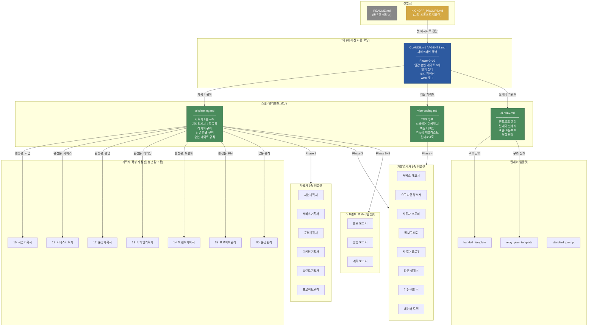
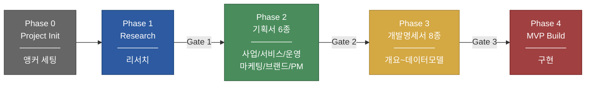
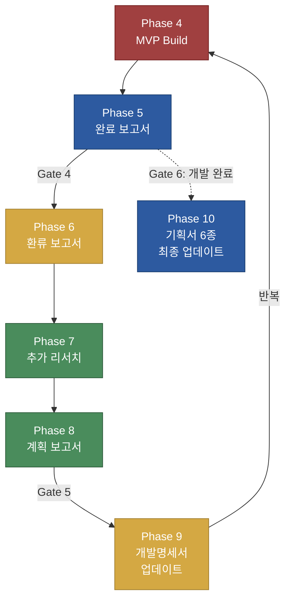
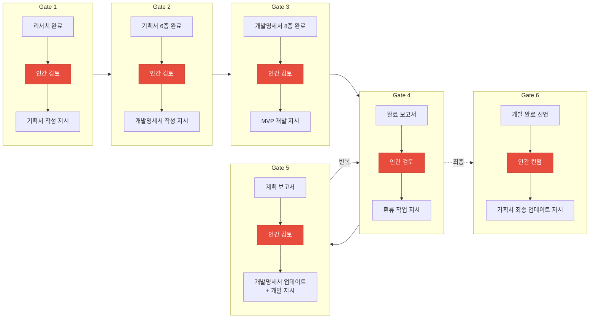
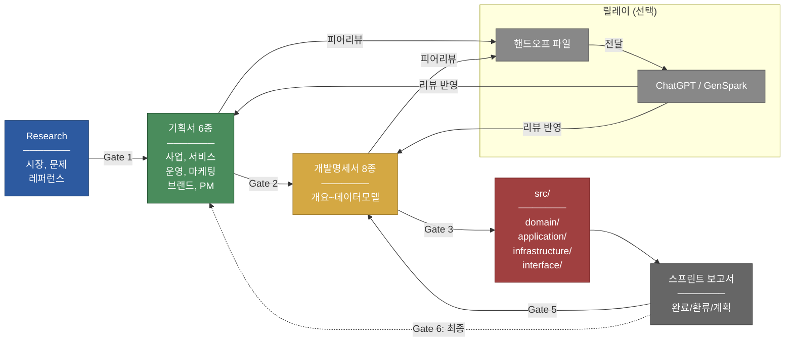
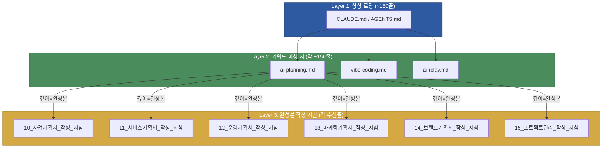

# 방법론 파일 연결 다이어그램

## 전체 구조

```mermaid
flowchart TB
    subgraph ENTRY["진입점"]
        README["README.md<br/>(공유용 설명서)"]
        KICKOFF["KICKOFF_PROMPT.md<br/>(시작 프롬프트 템플릿)"]
    end

    subgraph CORE["코어 (매 세션 자동 로딩)"]
        CLAUDE["CLAUDE.md / AGENTS.md<br/>파이프라인 앵커<br/>───────────<br/>Phase 0~10<br/>인간 승인 게이트 6개<br/>현재 상태<br/>코드 컨벤션<br/>ADR 로그"]
    end

    subgraph SKILLS["스킬 (온디맨드 로딩)"]
        PLAN["ai-planning.md<br/>───────────<br/>기획서 6종 규칙<br/>개발명세서 8종 규칙<br/>리서치 규칙<br/>환류 연결 규칙<br/>승인 게이트 규칙"]
        VIBE["vibe-coding.md<br/>───────────<br/>TDG 루프<br/>4-레이어 아키텍처<br/>파일 네이밍<br/>멱등성 체크리스트<br/>린터/Git훅"]
        RELAY["ai-relay.md<br/>───────────<br/>핸드오프 생성<br/>릴레이 설계서<br/>표준 프롬프트<br/>역할 정의"]
    end

    subgraph TMPL_PLAN["기획서 6종 템플릿"]
        T_BIZ["사업기획서"]
        T_SVC["서비스기획서"]
        T_OPS["운영기획서"]
        T_MKT["마케팅기획서"]
        T_BRD["브랜드기획서"]
        T_PM["프로젝트관리"]
    end

    subgraph TMPL_DEV["개발명세서 8종 템플릿"]
        T_SO["서비스 개요서"]
        T_REQ["요구사항 정의서"]
        T_US["사용자 스토리"]
        T_IA["정보구조도"]
        T_UF["사용자 플로우"]
        T_WF["화면 설계서"]
        T_FS["기능 정의서"]
        T_DM["데이터 모델"]
    end

    subgraph TMPL_SPRINT["스프린트 보고서 템플릿"]
        T_COMP["완료 보고서"]
        T_FB["환류 보고서"]
        T_PLN["계획 보고서"]
    end

    subgraph DOCS_PLAN["기획서 작성 지침 (완성본 참조용)"]
        D00["00_운영원칙"]
        D10["10_사업기획서"]
        D11["11_서비스기획서"]
        D12["12_운영기획서"]
        D13["13_마케팅기획서"]
        D14["14_브랜드기획서"]
        D15["15_프로젝트관리"]
    end

    subgraph DOCS_RELAY["릴레이 템플릿"]
        HO["handoff_template"]
        RP["relay_plan_template"]
        SP["standard_prompt"]
    end

    %% 진입점 → 코어
    KICKOFF -->|"첫 메시지로 전달"| CLAUDE

    %% 코어 → 스킬
    CLAUDE -->|"기획 키워드"| PLAN
    CLAUDE -->|"개발 키워드"| VIBE
    CLAUDE -->|"릴레이 키워드"| RELAY

    %% 스킬 → 템플릿
    PLAN -->|"Phase 2"| TMPL_PLAN
    PLAN -->|"Phase 3"| TMPL_DEV
    PLAN -->|"Phase 5~8"| TMPL_SPRINT
    VIBE -->|"Phase 4"| TMPL_DEV

    %% 기획 스킬 → 작성 지침
    PLAN -->|"완성본: 사업"| D10
    PLAN -->|"완성본: 서비스"| D11
    PLAN -->|"완성본: 운영"| D12
    PLAN -->|"완성본: 마케팅"| D13
    PLAN -->|"완성본: 브랜드"| D14
    PLAN -->|"완성본: PM"| D15
    PLAN -->|"공통 원칙"| D00

    %% 릴레이 스킬 → 템플릿
    RELAY -->|"구조 참조"| HO
    RELAY -->|"구조 참조"| RP

    %% 스타일
    style CLAUDE fill:#2d5aa0,stroke:#1a3d6e,color:#fff
    style PLAN fill:#4a8c5c,stroke:#2d5a3a,color:#fff
    style VIBE fill:#4a8c5c,stroke:#2d5a3a,color:#fff
    style RELAY fill:#4a8c5c,stroke:#2d5a3a,color:#fff
    style KICKOFF fill:#d4a843,stroke:#a07d2e,color:#fff
    style README fill:#888,stroke:#555,color:#fff
```

## 파이프라인 Phase 흐름

```mermaid
flowchart LR
    P0["Phase 0<br/>Project Init<br/>───────<br/>앵커 세팅"]
    P1["Phase 1<br/>Research<br/>───────<br/>리서치"]
    P2["Phase 2<br/>기획서 6종<br/>───────<br/>사업/서비스/운영<br/>마케팅/브랜드/PM"]
    P3["Phase 3<br/>개발명세서 8종<br/>───────<br/>개요~데이터모델"]
    P4["Phase 4<br/>MVP Build<br/>───────<br/>구현"]

    P0 --> P1
    P1 -->|"Gate 1"| P2
    P2 -->|"Gate 2"| P3
    P3 -->|"Gate 3"| P4

    style P0 fill:#666,stroke:#444,color:#fff
    style P1 fill:#2d5aa0,stroke:#1a3d6e,color:#fff
    style P2 fill:#4a8c5c,stroke:#2d5a3a,color:#fff
    style P3 fill:#d4a843,stroke:#a07d2e,color:#fff
    style P4 fill:#a04040,stroke:#6e1a1a,color:#fff
```

## 스프린트 루프 (Phase 4~9 반복)

```mermaid
flowchart TB
    P4["Phase 4<br/>MVP Build"]
    P5["Phase 5<br/>완료 보고서"]
    P6["Phase 6<br/>환류 보고서"]
    P7["Phase 7<br/>추가 리서치"]
    P8["Phase 8<br/>계획 보고서"]
    P9["Phase 9<br/>개발명세서<br/>업데이트"]
    P10["Phase 10<br/>기획서 6종<br/>최종 업데이트"]

    P4 --> P5
    P5 -->|"Gate 4"| P6
    P6 --> P7
    P7 --> P8
    P8 -->|"Gate 5"| P9
    P9 -->|"반복"| P4

    P5 -.->|"Gate 6: 개발 완료"| P10

    style P4 fill:#a04040,stroke:#6e1a1a,color:#fff
    style P5 fill:#2d5aa0,stroke:#1a3d6e,color:#fff
    style P6 fill:#d4a843,stroke:#a07d2e,color:#fff
    style P7 fill:#4a8c5c,stroke:#2d5a3a,color:#fff
    style P8 fill:#4a8c5c,stroke:#2d5a3a,color:#fff
    style P9 fill:#d4a843,stroke:#a07d2e,color:#fff
    style P10 fill:#2d5aa0,stroke:#1a3d6e,color:#fff
```

## 인간 승인 게이트 흐름

```mermaid
flowchart LR
    subgraph G1["Gate 1"]
        G1A["리서치 완료"]
        G1B["인간 검토"]
        G1C["기획서 작성 지시"]
    end

    subgraph G2["Gate 2"]
        G2A["기획서 6종 완료"]
        G2B["인간 검토"]
        G2C["개발명세서 작성 지시"]
    end

    subgraph G3["Gate 3"]
        G3A["개발명세서 8종 완료"]
        G3B["인간 검토"]
        G3C["MVP 개발 지시"]
    end

    subgraph G4["Gate 4"]
        G4A["완료 보고서"]
        G4B["인간 검토"]
        G4C["환류 작업 지시"]
    end

    subgraph G5["Gate 5"]
        G5A["계획 보고서"]
        G5B["인간 검토"]
        G5C["개발명세서 업데이트<br/>+ 개발 지시"]
    end

    subgraph G6["Gate 6"]
        G6A["개발 완료 선언"]
        G6B["인간 컨펌"]
        G6C["기획서 최종 업데이트 지시"]
    end

    G1A --> G1B --> G1C
    G2A --> G2B --> G2C
    G3A --> G3B --> G3C
    G4A --> G4B --> G4C
    G5A --> G5B --> G5C
    G6A --> G6B --> G6C

    G1 --> G2 --> G3 --> G4 --> G5
    G5 -->|"반복"| G4
    G4 -.->|"최종"| G6

    style G1B fill:#e74c3c,stroke:#c0392b,color:#fff
    style G2B fill:#e74c3c,stroke:#c0392b,color:#fff
    style G3B fill:#e74c3c,stroke:#c0392b,color:#fff
    style G4B fill:#e74c3c,stroke:#c0392b,color:#fff
    style G5B fill:#e74c3c,stroke:#c0392b,color:#fff
    style G6B fill:#e74c3c,stroke:#c0392b,color:#fff
```

## 산출물 흐름 (문서 = 다음 단계의 프롬프트)

```mermaid
flowchart LR
    R["Research<br/>───────<br/>시장, 문제<br/>레퍼런스"]
    P["기획서 6종<br/>───────<br/>사업, 서비스<br/>운영, 마케팅<br/>브랜드, PM"]
    D["개발명세서 8종<br/>───────<br/>개요~데이터모델"]
    CODE["src/<br/>───────<br/>domain/<br/>application/<br/>infrastructure/<br/>interface/"]
    RPT["스프린트 보고서<br/>───────<br/>완료/환류/계획"]

    R -->|"Gate 1"| P
    P -->|"Gate 2"| D
    D -->|"Gate 3"| CODE
    CODE --> RPT
    RPT -->|"Gate 5"| D

    RPT -.->|"Gate 6: 최종"| P

    subgraph HANDOFF["릴레이 (선택)"]
        HF["핸드오프 파일"]
        OTHER["ChatGPT / GenSpark"]
    end

    P -->|"피어리뷰"| HF
    D -->|"피어리뷰"| HF
    HF -->|"전달"| OTHER
    OTHER -->|"리뷰 반영"| P
    OTHER -->|"리뷰 반영"| D

    style R fill:#2d5aa0,stroke:#1a3d6e,color:#fff
    style P fill:#4a8c5c,stroke:#2d5a3a,color:#fff
    style D fill:#d4a843,stroke:#a07d2e,color:#fff
    style CODE fill:#a04040,stroke:#6e1a1a,color:#fff
    style RPT fill:#666,stroke:#444,color:#fff
    style HF fill:#888,stroke:#555,color:#fff
    style OTHER fill:#888,stroke:#555,color:#fff
```

## 컨텍스트 로딩 단계

```mermaid
flowchart TB
    subgraph L1["Layer 1: 항상 로딩 (~150줄)"]
        C1["CLAUDE.md / AGENTS.md"]
    end

    subgraph L2["Layer 2: 키워드 매칭 시 (각 ~150줄)"]
        C2A["ai-planning.md"]
        C2B["vibe-coding.md"]
        C2C["ai-relay.md"]
    end

    subgraph L3["Layer 3: 완성본 작성 시만 (각 수천줄)"]
        C3A["10_사업기획서_작성_지침"]
        C3B["11_서비스기획서_작성_지침"]
        C3C["12_운영기획서_작성_지침"]
        C3D["13_마케팅기획서_작성_지침"]
        C3E["14_브랜드기획서_작성_지침"]
        C3F["15_프로젝트관리_작성_지침"]
    end

    C1 --> C2A
    C1 --> C2B
    C1 --> C2C
    C2A -->|"깊이=완성본"| C3A
    C2A -->|"깊이=완성본"| C3B
    C2A -->|"깊이=완성본"| C3C
    C2A -->|"깊이=완성본"| C3D
    C2A -->|"깊이=완성본"| C3E
    C2A -->|"깊이=완성본"| C3F

    style L1 fill:#2d5aa0,stroke:#1a3d6e,color:#fff
    style L2 fill:#4a8c5c,stroke:#2d5a3a,color:#fff
    style L3 fill:#d4a843,stroke:#a07d2e,color:#fff
```
