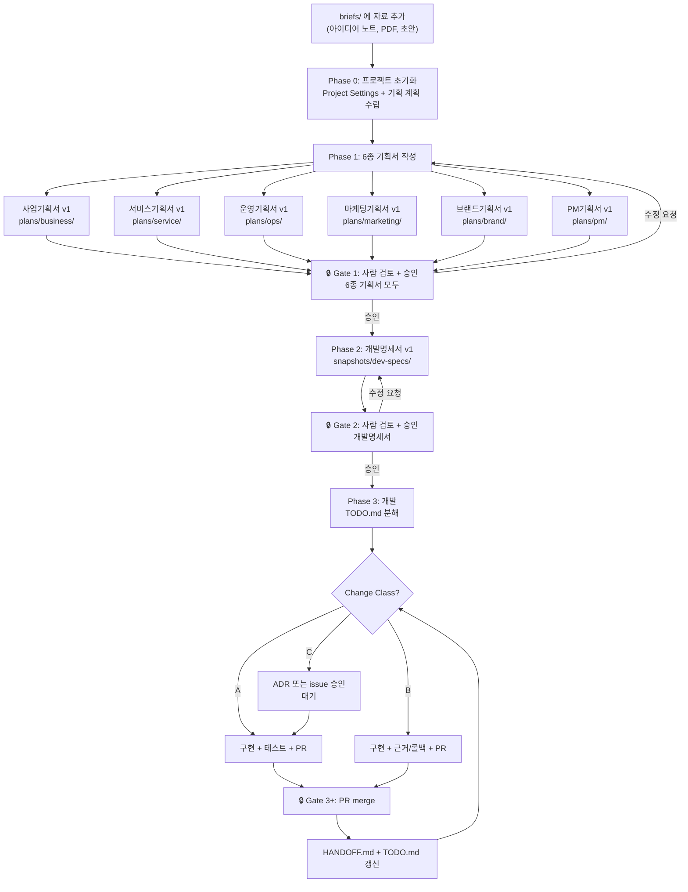
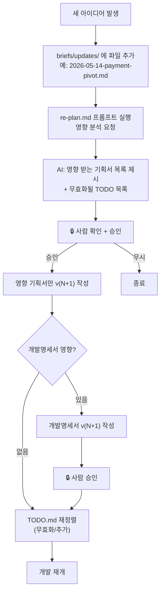
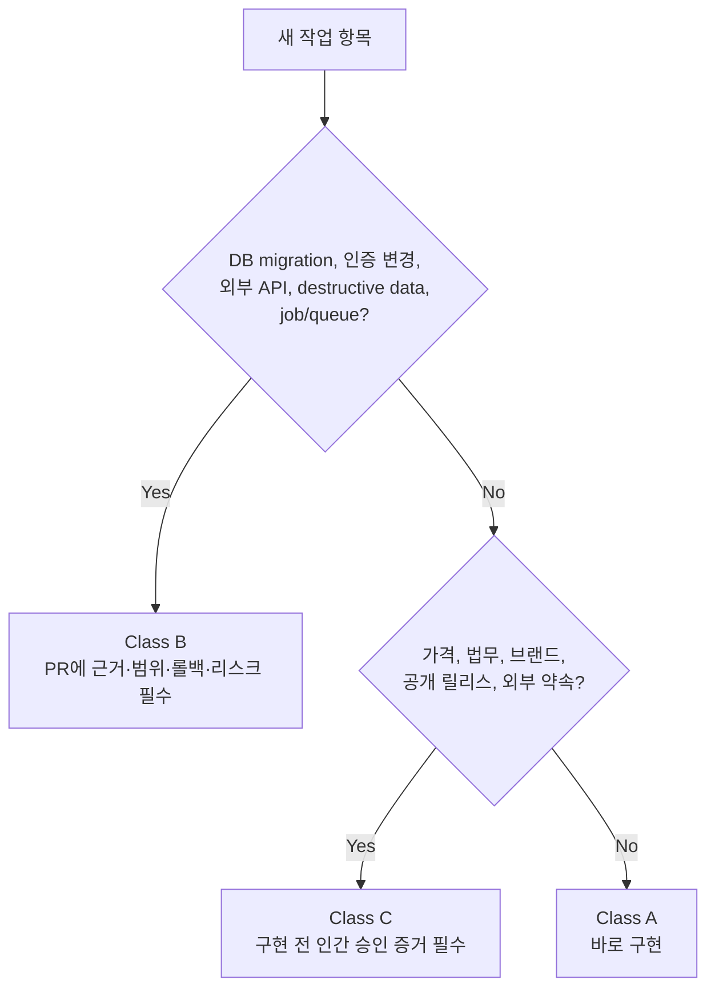
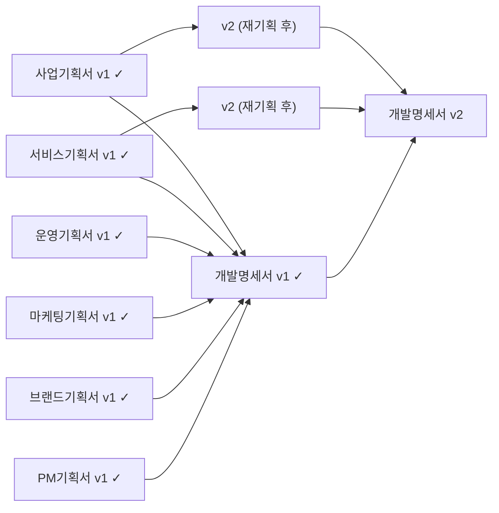
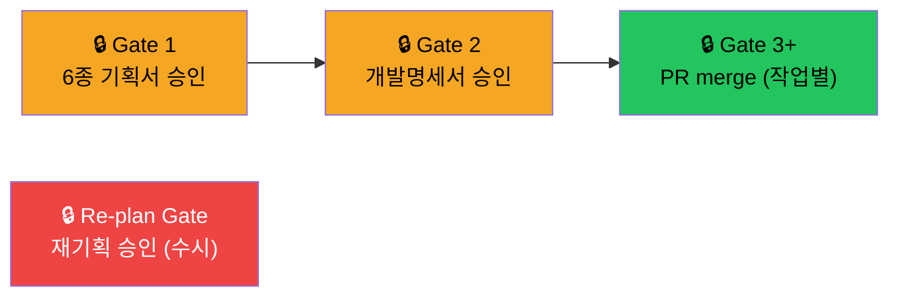

# Diagrams

## Full Workflow (Brief-Based)

```mermaid
flowchart TD
    A["briefs/ 에 자료 추가\n(아이디어 노트, PDF, 초안)"]
    A --> B["Phase 0: 프로젝트 초기화\nProject Settings + 기획 계획 수립"]
    B --> P1["Phase 1: 6종 기획서 작성"]

    P1 --> P1A["사업기획서 v1\nplans/business/"]
    P1 --> P1B["서비스기획서 v1\nplans/service/"]
    P1 --> P1C["운영기획서 v1\nplans/ops/"]
    P1 --> P1D["마케팅기획서 v1\nplans/marketing/"]
    P1 --> P1E["브랜드기획서 v1\nplans/brand/"]
    P1 --> P1F["PM기획서 v1\nplans/pm/"]

    P1A & P1B & P1C & P1D & P1E & P1F --> G1

    G1["🔒 Gate 1: 사람 검토 + 승인\n6종 기획서 모두"]
    G1 -->|승인| P2["Phase 2: 개발명세서 v1\nsnapshots/dev-specs/"]
    G1 -->|수정 요청| P1

    P2 --> G2["🔒 Gate 2: 사람 검토 + 승인\n개발명세서"]
    G2 -->|승인| P3["Phase 3: 개발\nTODO.md 분해"]
    G2 -->|수정 요청| P2

    P3 --> CL{"Change Class?"}
    CL -->|A| IA["구현 + 테스트 + PR"]
    CL -->|B| IB["구현 + 근거/롤백 + PR"]
    CL -->|C| IC["ADR 또는 issue 승인\n대기"]
    IC --> IA
    IA --> G3["🔒 Gate 3+: PR merge"]
    IB --> G3
    G3 --> UPD["HANDOFF.md + TODO.md 갱신"]
    UPD --> CL
```

## Re-Plan Flow (개발 중 방향 변경)

```mermaid
flowchart TD
    A["새 아이디어 발생"]
    A --> B["briefs/updates/ 에 파일 추가\n예: 2026-05-14-payment-pivot.md"]
    B --> C["re-plan.md 프롬프트 실행\n영향 분석 요청"]
    C --> D["AI: 영향 받는 기획서 목록 제시\n+ 무효화될 TODO 목록"]
    D --> E["🔒 사람 확인 + 승인"]
    E -->|승인| F["영향 기획서만 v(N+1) 작성"]
    E -->|무시| Z["종료"]
    F --> G{"개발명세서 영향?"}
    G -->|있음| H["개발명세서 v(N+1) 작성"]
    G -->|없음| I["TODO.md 재정렬\n(무효화/추가)"]
    H --> HG["🔒 사람 승인"]
    HG --> I
    I --> J["개발 재개"]
```

## Change Class Decision

```mermaid
flowchart TD
    A["새 작업 항목"] --> B{"DB migration, 인증 변경,\n외부 API, destructive data,\njob/queue?"}
    B -->|Yes| C["Class B\nPR에 근거·범위·롤백·리스크 필수"]
    B -->|No| D{"가격, 법무, 브랜드,\n공개 릴리스, 외부 약속?"}
    D -->|Yes| E["Class C\n구현 전 인간 승인 증거 필수"]
    D -->|No| F["Class A\n바로 구현"]
```

## Document Version Tree

```mermaid
flowchart LR
    B1["사업기획서 v1 ✓"] --> B2["v2 (재기획 후)"]
    S1["서비스기획서 v1 ✓"] --> S2["v2 (재기획 후)"]
    O1["운영기획서 v1 ✓"]
    M1["마케팅기획서 v1 ✓"]
    BR1["브랜드기획서 v1 ✓"]
    P1["PM기획서 v1 ✓"]

    B2 & S2 --> DS2["개발명세서 v2"]
    B1 & S1 & O1 & M1 & BR1 & P1 --> DS1["개발명세서 v1 ✓"]
    DS1 --> DS2
```

## Human Approval Gates

```mermaid
flowchart LR
    G1["🔒 Gate 1\n6종 기획서 승인"] --> G2["🔒 Gate 2\n개발명세서 승인"]
    G2 --> G3["🔒 Gate 3+\nPR merge (작업별)"]
    GR["🔒 Re-plan Gate\n재기획 승인 (수시)"]

    style G1 fill:#f5a623,color:#000
    style G2 fill:#f5a623,color:#000
    style G3 fill:#22c55e,color:#000
    style GR fill:#ef4444,color:#fff
```
